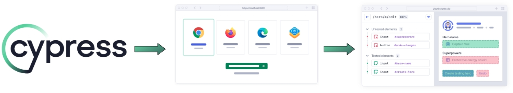
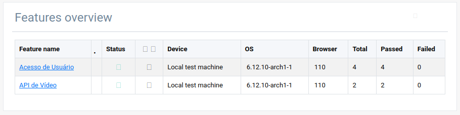
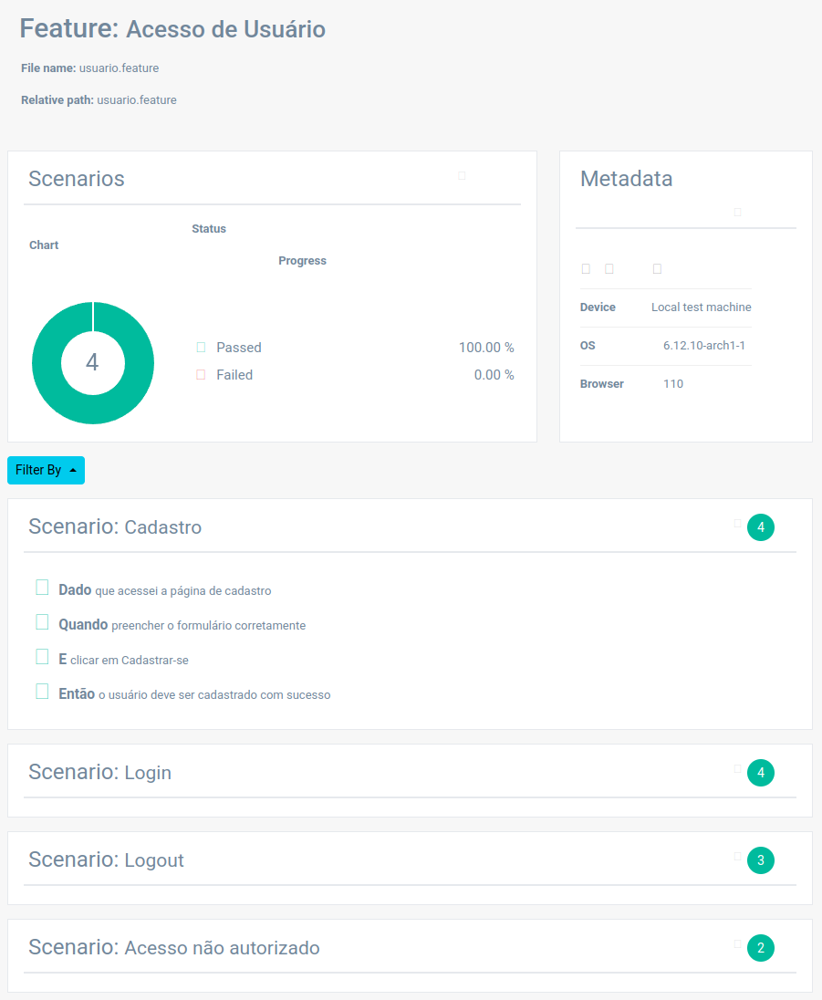
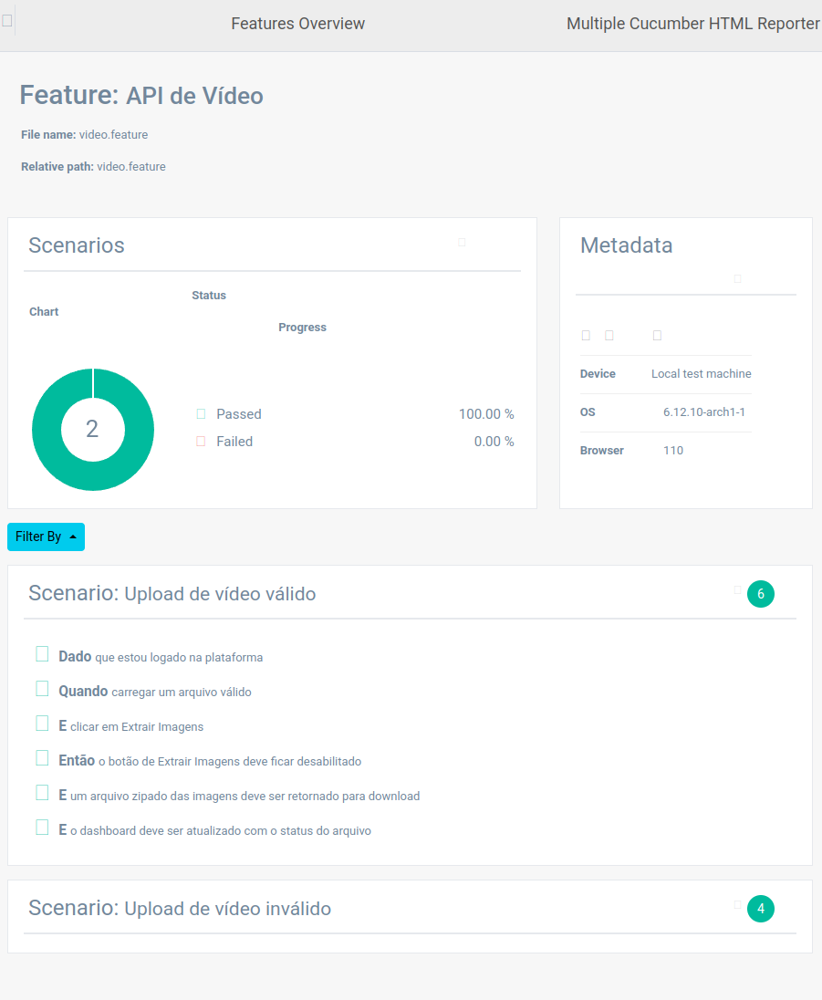

# Testes Automatizados com Cypress </img>
Testes automatizados para o Sistema de Processamento de Imagens em Vídeo [VIMG](https://github.com/6SOATGP54/hackathon-automated-tests).

[Cypress](https://www.cypress.io/) é uma ferramenta de automação de testes end-to-end (E2E), de código aberto, voltada principalmente para testar aplicações _web_.
<p align="center">
    </img>
</p>

As principais funcionalidades do sistema de processamento de imagens são testadas através desta ferramenta que se integra à esteira DevOps, e pode ser acionada por meio do GitHub Actions para validar possíveis regressões de código após a implantação.

<p align="center">
    </img>
</p>

## Relatórios

A ferramenta também gera relatório gráfico das funcionalidades testadas e, caso uma falha ocorra, em qual passo houve ocorreu o defeito.

<p align="center">
	</img>
</p>

<p align="center">
	</img>
</p>

# Domínios

O projeto de automação testa o domínio do sistema.

O teste funcional é descrito em alto nível seguindo o padrão de escrita _Gherkin_ do _Behavior Driven Development_ (BDD).

```gherkin
Funcionalidade: Acesso de usuário

  Cenário: Login
	  Dado que acessei a página de login
	  Quando inserir as credenciais
	  E clicar em Login
	  Então devo ser redirecionado ao dashboard para upload de vídeo
```

Para cada _step_ do cenário em alto nível há uma implementação técnica:

```javascript
Given('que acessei a página de login', () => {
	cy.visit('/')
		.title()
		.should('include', 'Login')
})

When('inserir as credenciais', () => {
	const email = Cypress.env('AUTOMATED_USER')
	const password = Cypress.env('USER_SECRET')

	cy.get(loginLocators.INPUT_EMAIL).click()
	cy.get(loginLocators.INPUT_EMAIL).type(email)

	cy.get(loginLocators.INPUT_PASSWORD).click()
	cy.get(loginLocators.INPUT_PASSWORD).type(password)
})

And('clicar em Login', () => {
	cy.get(loginLocators.BTN_LOGIN).click()
})

Then('devo ser redirecionado ao dashboard para upload de vídeo', () => {
	cy.url().should('include', '/upload')
})
```

## Estrutura do projeto

Os cenários de teste em _gherkin_ são escritos com auxilio do [Cucumber](https://cucumber.io/). Encontram-se no diretório de "features". Já as implementações dos cenários de teste, chamadas também de casos de teste, estão no diretório de "step-definitions".

```
cypress/
├── e2e/
│   ├── features/
│   │   ├── usuario.feature
│   │   └── video.feature
│   └── step-definitions/
│       ├── usuario.cy.js
│       └── video.cy.js
├── fixtures/
│   ├── video_automated_test.mp4
│   └── video_automated_test.mpg
├── reports/
├── screenshots/
└── support/
	├── commands.js
	├── cucumber-html-report.js
	├── e2e.js
	└── elements/
		├── dashboard-page.json
		├── login-page.json
		└── signup-page.json
```

# Execução
Para execução local é necessário ter uma versão Node instalado e executar o comando `npm install`.

Para executar na esteira, rodar o job pelo GitHub Actions.
* npx cypress open → execução assistida através de um navegador de sua preferência
* npx cypress run → execução headless que gera o resultado através de um terminal

Estas são as variáveis de ambiente obrigatórios, que podem ser colocadas em um `cypress.env.json`, ou exportadas na máquina de execução:
```json
{
    "AUTOMATED_USER": "automation.user@fiap.com",
    "USER_SECRET": "7}=lEU3c@UL(2U;{",
    "CYPRESS_BASE_URL": "https://aplicacao-exemplo.execute-api.us-east-1.amazonaws.com.app/"
}
```
