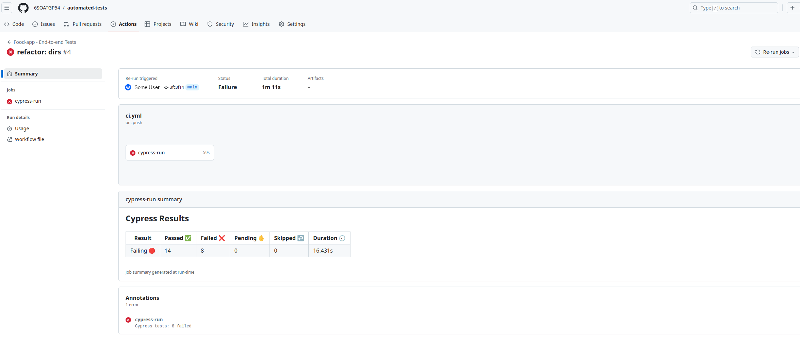

# Testes Automatizados com Cypress </img>
Testes automatizados para o Sistema de controle para pedidos de autoatendimento em lanchonete integrado à API de pagamento do Mercado Pago.

[Cypress](https://www.cypress.io/) é uma ferramenta de automação de testes end-to-end (E2E), de código aberto, voltada principalmente para testar aplicações _web_.
<p align="center">
    </img>
</p>

Todas as APIs do [Tech Challenge](https://github.com/6SOATGP54/tech-challenge) são testadas através desta ferramenta que se integra à esteira DevOps, acionada por meio do GitHub Actions para validar possíveis regressões de código.

<p align="center">
    </img>
</p>

# Domínios

O projeto de automação testa o domínio de produto.

O teste funcional é descrito em alto nível seguindo o padrão de escrita _Gherkin_ do _Behavior Driven Development_ (BDD).

```gherkin
Funcionalidade: API de Catálogo de Produtos

  Cenário: Listagem de Produtos pela Categoria Lanche
    Dado que consultei a lista de 'LANCHE'
    Quando a API de produtos for chamada com sucesso
    Então a lista de produtos deve conter somente 'LANCHE'
```

Para cada _step_ do cenário em alto nível há uma implementação técnica:

```javascript
Given('que consultei a lista de {string}', (categoria) => {
	cy.request({
		method: 'POST',
		url: '/produto/listarProdutosPorCategoria',
		body: `"${categoria}"`,
		headers: {
			'accept': '*/*',
			'Content-Type': 'application/json'
		}
	}).as('response')
})

When('a API de produtos for chamada com sucesso', () => {
	cy.get('@response').its('status').should('eq', 200)
})

Then('a lista de produtos deve conter somente {string}', (categoria) => {
	cy.get('@response')
		.its('body')
		.should('be.an', 'array')
		.and('not.be.empty')
		.and((produtos) => {
			expect(produtos.every((item) => item.categoria === categoria)).to.be.true
		}).then((response) => {
			cy.log(JSON.stringify(response))
		})
})
```

## Estrutura do projeto

Os cenários de teste em _gherkin_ são escritos com auxilio do [Cucumber](https://cucumber.io/). Encontram-se no diretório de "features". Já as implementações dos cenários de teste, chamadas também de casos de teste, estão no diretório de "step-definitions".

```
cypress/
├── e2e/
│   ├── features/
│   │   ├── 1-domain/
│   │   │   ├── testes-de-dominio.feature
│   │   └── 2-integration/
│   │       └── testes-de-integracao.feature
│   └── step-definitions/
│       ├── 1-domain/
│       │   ├── testes-de-dominio.cy.js
│       └── 2-integration/
│           └── testes-de-integracao.cy.js
├── fixtures/
│   ├── payloads-para-testes.json
├── screenshots/
│   ├── evidencias-da-execucao-dos-testes.png
└── support/
    ├── commands.js
    ├── cucumber-html-report.js
    └── e2e.js
```

# Execução
Para execução local é necessário ter uma versão Node instalado e executar o comando `npm install`.

Para executar na esteira, rodar o job pelo GitHub Actions.
* npx cypress open → execução assistida através de um navegador de sua preferência
* npx cypress run → execução headless que gera o resultado através de um terminal

Estas são as variáveis de ambiente obrigatórios, que podem ser colocadas em um `cypress.env.json`, ou exportadas na máquina de execução:
```json
{
    "MERCADO_PAGO_TOKEN": "APP_USR-EXEMPLO-10507407901",
    "MERCADO_PAGO_USUARIO": "10507407901",
    "APP_WEBHOOK": "https://webhook-exemplo.execute-api.us-east-1.amazonaws.com",
    "API_GTW_TOKEN_USER": "14604110804",
    "API_GTW_TOKEN_SECRET": "&senhaExemplo#441!",
    "API_GTW_TOKEN_URL": "https://lambda-exemplo.execute-api.us-east-1.amazonaws.com",
    "CYPRESS_BASE_URL": "https://aplicacao-exemplo.execute-api.us-east-1.amazonaws.comee.app/api"
}
```